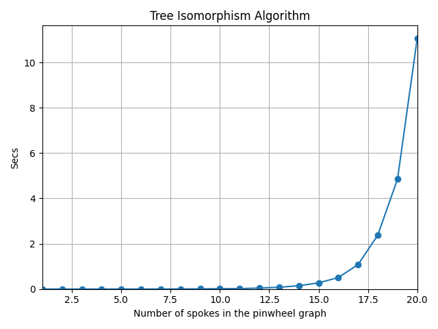
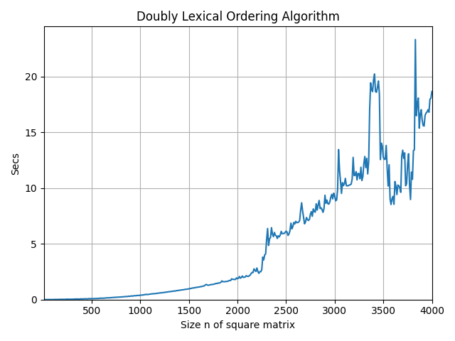

# Thesis Algorithms

An implementation for the algorithms I studied on my Bachelor of Science Thesis
on Computer Science.

## Tree Isomorphism Algorithm

Algorithm to determine if two arbitrary trees are isomorphic in O(n) time and
space.

### Performance

The following line chart showcases the performacne of the algorithm on different
entries of varying sizes.

<p align="center">
  
</p>

In this case, given the spokes in the pinwheel graph, the amount of vertices
contained in the tree grows exponentially; it it has n-spokes then the tree has
2^n vertices. The worst-case scenario of this algorithm is when an isomorphism
exists. So the algorithm is tested with a pinwheel graph and a copy of this
graph, this way we can be sure that an isomorphism will always exists; and an
extra is that for these graphs there is only one isomorphism. Thus, the
performance obtained is amount of time it takes to produce an isomorphism
between the trees.

#### Definition of a Pinwheel Graph

The following algorithm produces a pinwheel graph:

```
Graph<Integer> pinwheel = new Graph<>();
pinwheel.addVertex(0);
for (int i = 0; i < numBranches; i++) {
	LinkedList<Integer> path = new LinkedList<>();
	path.add(0);
	for (int j = pinwheel.order(); j < 2 * pinwheel.order(); j++) {
		path.add(j);
	}
	pinwheel.addPath(path);
}
return pinwheel;
```

As we can observe, with each new *spoke* or *branch* the amount of vertices
doubles.

### References

[[1](https://www.cs.upc.edu/~valiente/algorithm/)]
    G. Valiente, "Algorithms on Trees and Graphs", Springer, 2002.

[[2](https://www.pearson.com/en-us/subject-catalog/p/design-and-analysis-of-computer-algorithms-the/P200000003488/9780201000290)]
    A. V. Aho, J. E. Hopcroft and J. D. Ullman, "The Design and Analysis of
    Computer Algorithms", Addison Wesley Publishing Company, 1974.

## Doubly Lexical Ordering

A **doubly lexical ordering** (also known as a **doubly lexicographical
ordering**) of matrix is an ordering of the rows and columns of the matrix so
that the rows, as vectors, are lexically increasing and the columns, as vectors,
are lexically increasing. The lexical ordering of vectors is the standard
dictionary ordering (often called "lexicographic").  Given a (0,1)-matrix M of
size n x n, the algorithm runs in time O(n^2 log n) and space O(n^2).

### Performance

The following line chart showcases the performance of the algorithm on
different entries of varying sizes.

<p align="center">
  
</p>

In this case, the size of a matrix represents the number of rows and columns
contained in the matrix. For example, if `n = 500`, then the matrix has 500
rows and columns, and thus it contains 250,000 entries.

### References

[[3](https://doi.org/10.1137/0216057)]
    A. Lubiw, "Doubly Lexical Ordering of Matrices", SIAM Journal on Computing,
    1987.

[[4](https://doi.org/10.1137/0216062)]
    R. Paige, R. E. Tarjan, "Three Partition Refinement Algorithms", SIAM
    Journal on Computing, 1987.


## Compilation and Unit testing

### Requirements

* Java and Javac (Preferably version >= 19.0.1)
* Maven (Preferably version >= 3.8.6)

The program should compile with no errors executing the following command:

```
$ mvn compile
```

To run the unit tests run the following:

```
$ mvn test
```

Finally, to execute the program and obtain the performance of the algorithms
with multiple entries of different sizes run the following command:

```
$ mvn install
...
$ java -jar target/thesis-algorithms
```

The previous program has the following usage:

```
Usage: ./thesis-algorithms <algorithm> <N>
Arguments:
    <algorithm> The algorithm to check its performance.
    <N>         An integer number specifying the at which
                entry size to stop the algorithm.
Algorithm options:
    treeisomorphism   The tree isomorphism algorithm.
    doublylexordering The doubly lexical ordering algorithm.
Notes on the size of the entry:
    In the case of the tree isomorphism, the <N> argument is
    the amount of spokes or branches the pinwheel graph has,
    the amount of nodes contained in the tree scales
    exponentially; if it has n-spokes it has 2^n vertices.
    In the case of the doubly lexical ordering, the <N>
    argument is the number of rows and columns contained in
    the matrix. For example, if <N> = 500, then the last
    matrix to be tested will have 250,000 entries.

```

The output is the performance of the implemented algorithms in a `csv`
format. The output can be relatively large depending on the number of entries
that will be tested, so its recommended to pipe the previous command to a
different file, e.g.:

```
$ java -jar target/thesis-algorithms <alg> <N> > values.csv
```

### Plotting the values

#### Requirements

* Matplotlib (Preferably version >= 3.6.2)

The program `plotter.py` returns a line chart of the obtained `csv` values,
simply run:

```
python plotter.py <data.csv> <plot-title> <x-label> <y-label> <output>
```

The chart is then saved as an image on the file path specified by `<output>`.
